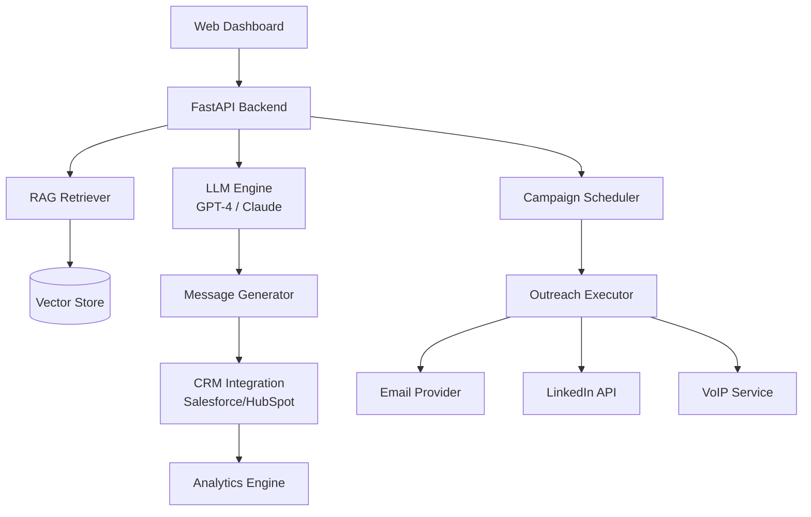
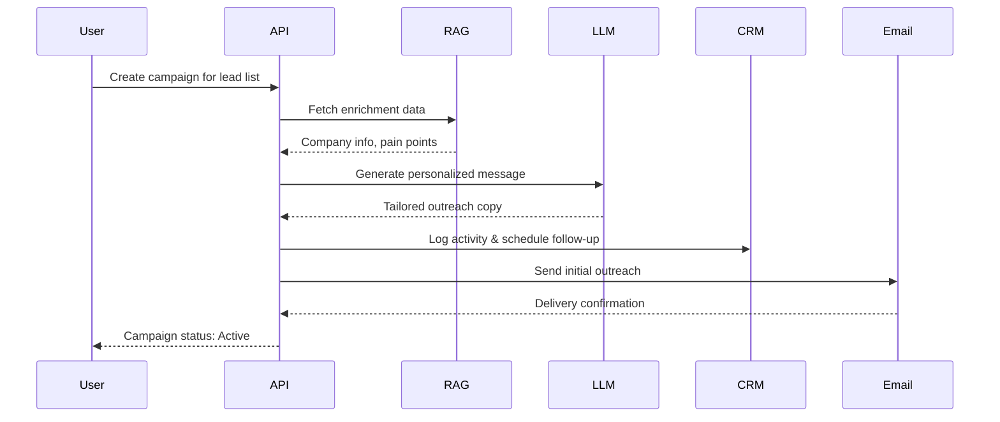

# 🎯 ArtisanBDR

```
   ___          __  _                 ____  ____  ____ 
  / _ | ______ / /_(_)__ ___ ____    / __ \/ __ \/ __ \
 / __ |/ __/ // __/ (_-</ _ `/ _ \  / /_/ / / / / /_/ /
/_/ |_/_/  \_, /\__/_/___/\_,_/_//_/  \____/_/ /_/\__, / 
          /___/                                   /____/  
          
    AI Business Development Representative
    Built for scale. Optimized for conversion.
```

  

**Autonomous AI-BDR that researches, personalizes, and closes deals.**

---

## 📋 Table of Contents

- [Key Features](#-key-features)
- [Live Demo](#-live-demo--screenshots)
- [Architecture](#-architecture)
- [Quickstart](#-quickstart)
- [Usage](#-usage)
- [Persona & Prompt Library](#-persona--prompt-library)
- [Outreach Playbook](#-outreach-playbook)
- [Evaluation & Metrics](#-evaluation--metrics)
- [Deployment](#-deployment--infrastructure)
- [Configuration](#-configuration--tuning)
- [Contributing](#-contributing)

---

## ✨ Key Features

- **🧠 Context-Aware Research** — RAG-powered lead enrichment from web, CRM, and internal docs
- **✍️ Hyper-Personalized Outreach** — LLM generates tailored emails, LinkedIn messages, and call scripts
- **🔄 Multi-Channel Sequences** — Automated follow-ups across email, LinkedIn, and phone
- **📊 Real-Time Analytics** — Track reply rates, qualification metrics, and pipeline velocity
- **🔗 Native CRM Sync** — Bi-directional integration with Salesforce, HubSpot, and Pipedrive
- **⚡ Production-Ready** — Docker + K8s deployment with rate limiting and PII compliance

---

## 🎬 Live Demo / Screenshots

<!-- screenshot: dashboard -->

*Campaign performance dashboard showing active sequences and engagement metrics*

<!-- screenshot: outreach editor -->

*AI-powered message editor with real-time personalization suggestions*

---

## 🏗 Architecture



### Sequence Flow: Cold Outreach



---

## 🚀 Quickstart

### Installation

```bash
# Clone the repository
git clone https://github.com/yourusername/artisanbdr.git
cd artisanbdr

# Install dependencies
pip install -r requirements.txt
```

### Configure Environment

```bash
# Copy example config
cp .env.example .env

# Edit with your API keys
# Required: LLM_API_KEY, CRM_TOKEN, RAG_INDEX_PATH
```

### Run Development Server

```bash
# Start the API server
python -m uvicorn app.main:app --reload --port 8000

# Access dashboard at http://localhost:8000
```

---

## 💻 Usage

### Python API Example

```python
from artisanbdr import ArtisanClient

# Initialize client
client = ArtisanClient(api_key="your_api_key")

# Create outreach campaign
campaign = client.campaigns.create(
    name="Q1 Enterprise Outreach",
    personas=["Enterprise Hunter"],
    lead_list="./leads.csv"
)

# Generate personalized message for a contact
message = client.outreach.generate(
    contact={
        "name": "Sarah Chen",
        "company": "TechCorp",
        "role": "VP Engineering"
    },
    template="enterprise_cold_email_v1",
    context={"pain": "legacy infrastructure costs"}
)

print(message.body)
# "Hi Sarah, I noticed TechCorp recently..."

# Push to CRM and schedule send
client.crm.sync(campaign_id=campaign.id)
client.outreach.schedule(message, send_at="2024-01-15 09:00")
```

### cURL Example

```bash
# Trigger an outreach sequence
curl -X POST https://api.artisanbdr.com/v1/campaigns/seq_123/trigger \
  -H "Authorization: Bearer YOUR_API_KEY" \
  -H "Content-Type: application/json" \
  -d '{
    "contact_id": "lead_456",
    "sequence": "enterprise_3touch",
    "channel": "email"
  }'
```

---

## 🎭 Persona & Prompt Library

### 1. Enterprise Hunter

**Use case:** Target F500 companies with complex buying committees

**Prompt:**
```
You are an enterprise BDR selling to {{company}}, a {{industry}} company with {{employee_count}} employees. 
The contact is {{contact_name}}, {{job_title}}. Their key pain point is {{pain}}.

Write a cold email that:
- References their recent {{trigger_event}}
- Positions our solution as solving {{pain}}
- Requests a 15-min discovery call
- Tone: Professional, consultative, concise (under 100 words)
```

**Example (filled):**
```
Contact: Sarah Chen, VP Engineering at TechCorp (5,000 employees)
Pain: Legacy infrastructure costs
Trigger: Recent $50M Series C funding

---

Hi Sarah,

Congrats on TechCorp's Series C! With your team scaling rapidly, I imagine managing infrastructure costs across legacy systems is becoming critical.

We've helped engineering teams at DataDog and Stripe reduce cloud spend by 40% while modernizing their stack. Would love to show you how we're doing this in a quick 15-min call.

Available this Thursday at 10am PT?

Best,
[Your name]
```

### 2. Mid-Market Nurturer

**Prompt:**
```
You are a warm, relationship-focused BDR reaching out to {{contact_name}} at {{company}}, a mid-market {{industry}} company.
They've previously {{past_interaction}}. 

Write a nurture follow-up email that:
- References past touchpoint naturally
- Shares valuable insight related to {{pain}}
- Offers help without hard selling
- Tone: Friendly, helpful, human (80-120 words)
```

### 3. DevTools SDR

**Prompt:**
```
You are a technical SDR targeting developers and engineering leaders. Contact: {{contact_name}}, {{job_title}} at {{company}}.
They are building {{tech_stack}} and facing {{technical_challenge}}.

Write a developer-friendly outreach that:
- Demonstrates technical credibility
- Includes a code snippet or technical resource
- Focuses on solving {{technical_challenge}}
- Tone: Technical, peer-to-peer, no fluff (100 words max)
```

### 4. Upsell Specialist

**Prompt:**
```
You are reaching out to {{contact_name}}, an existing customer at {{company}}. They currently use {{current_product}}.
Based on usage data, they would benefit from {{upsell_product}}.

Write an upsell email that:
- References their current success with our product
- Shows data-driven ROI from upgrade
- Makes expansion feel natural, not pushy
- Tone: Partner-oriented, data-backed (90 words)
```

### 5. Event Follow-Up Pro

**Prompt:**
```
You met {{contact_name}} from {{company}} at {{event_name}}. They mentioned {{conversation_topic}}.

Write a same-day follow-up that:
- References specific conversation detail
- Provides promised resource/intro
- Suggests next step within 48 hours
- Tone: Energetic, timely, action-oriented (70 words)
```

### 6. Referral Closer

**Prompt:**
```
{{referrer_name}} from {{referrer_company}} introduced you to {{contact_name}} at {{company}}.

Write a warm intro email that:
- Mentions referrer authentically
- Explains why referrer thought of you
- Makes scheduling frictionless
- Tone: Warm, grateful, efficient (60-80 words)
```

### 7. Re-Engagement Specialist

**Prompt:**
```
{{contact_name}} at {{company}} went dark {{days_ago}} days ago after {{last_interaction}}.

Write a re-engagement email that:
- Acknowledges the gap without guilt-tripping
- Offers new value (case study, feature, insight)
- Gives easy out OR easy re-entry
- Tone: Low-pressure, value-first (100 words)
```

### 8. C-Suite ExecutiveReach

**Prompt:**
```
You are reaching out to {{contact_name}}, {{c_level_title}} at {{company}}, a {{industry}} leader with {{revenue}}.
They care about {{strategic_priority}}.

Write an executive-level outreach that:
- Focuses on business outcomes, not features
- References industry trends or competitive intel
- Requests 20-min strategic conversation
- Tone: Peer-level, strategic, respect their time (80 words max)
```

---

## 📬 Outreach Playbook

### Email Sequence: Enterprise 3-Touch

**Day 0 — Initial Outreach**
```
Subject: Quick question about {{company}}'s {{initiative}}

Hi {{first_name}},

I noticed {{company}} recently {{trigger_event}}. Teams scaling at your pace often hit bottlenecks around {{pain}}.

We help companies like {{competitor_1}} and {{competitor_2}} solve this. Worth a 15-min conversation?

Best,
{{sender_name}}
```

**Day 3 — Value-Add Follow-Up**
```
Subject: Re: Quick question about {{company}}'s {{initiative}}

{{first_name}},

Sharing a quick case study — {{similar_company}} reduced {{metric}} by {{improvement}}% using our approach.

Thought it might resonate given your {{context}}. 10 minutes this week to discuss?

{{sender_name}}
```

**Day 7 — Breakup Email**
```
Subject: Closing the loop

Hi {{first_name}},

Haven't heard back — probably not the right time. 

If priorities shift, here's a link to our {{resource_type}}: {{link}}

Wishing you success with {{initiative}}.

Best,
{{sender_name}}
```

### LinkedIn Sequence: Warm Connection

**Day 0 — Connection Request**
```
Hi {{first_name}}, saw you're leading {{initiative}} at {{company}}. We're helping similar teams with {{pain}}. Would love to connect!
```

**Day 4 — Ice Breaker Message**
```
Thanks for connecting! Curious — what's your biggest challenge with {{domain}} right now?
```

**Day 8 — Soft Pitch**
```
Based on your {{recent_post}}, seems like {{pain}} is top of mind. We've helped teams like {{competitor}} tackle this. Open to a quick chat?
```

### Cold Call Script: Discovery Opener

**Opening (15 sec)**
```
Hi {{first_name}}, this is {{caller_name}} from ArtisanBDR. 
I know I'm calling out of the blue — do you have 45 seconds?

[Wait for yes]

Great. I'm reaching out because we help {{industry}} companies solve {{pain}}. 
Wanted to see if that's something on your radar?
```

**Objection: "Not interested"**
```
Totally understand. Before I let you go — are you currently dealing with {{specific_pain}}?

[If yes] → Quick question: what's your current approach?
[If no] → Got it. Who on your team handles {{domain}}? Happy to reach out to them instead.
```

**Close**
```
How about this — I'll send you a quick one-pager on how {{competitor}} solved this. 
If it resonates, we can schedule 15 minutes. Fair?
```

---

## 📊 Evaluation & Metrics

### KPI Dashboard

```
┌─────────────────────────────────────────┐
│   ArtisanBDR Performance Metrics        │
├─────────────────────────────────────────┤
│  Reply Rate:            18.2%           │
│  Qualified Leads:        4.1%           │
│  Demo Conversion:        1.5%           │
│  Avg Time-to-Response:   2.3 hrs        │
│  Sequence Completion:   87%             │
└─────────────────────────────────────────┘
```

### Testing Framework

**A/B Test Ideas:**
- Subject line variants (question vs. statement)
- Email length (50 words vs. 100 words)
- CTA placement (top vs. bottom)
- Personalization depth (company-level vs. role-level)

**Unit Tests for Prompt Outputs:**
```python
def test_email_length():
    assert len(generated_email.split()) <= 100

def test_personalization_variables():
    assert "{{" not in generated_email  # All vars filled
    
def test_cta_present():
    assert any(cta in generated_email.lower() 
               for cta in ["call", "meeting", "chat", "demo"])
```

**Evaluation Metrics:**
- Relevance score (1-5, human-labeled)
- Spam score (via SpamAssassin)
- Readability (Flesch-Kincaid Grade Level < 10)
- Personalization density (custom variables per 100 words)

---

## 🚢 Deployment & Infrastructure

### Docker

```bash
docker build -t artisanbdr:latest .
docker run -p 8000:8000 --env-file .env artisanbdr:latest
```

### Kubernetes

```yaml
# Sample deployment config
apiVersion: apps/v1
kind: Deployment
metadata:
  name: artisanbdr
spec:
  replicas: 3
  template:
    spec:
      containers:
      - name: api
        image: artisanbdr:latest
        env:
        - name: LLM_API_KEY
          valueFrom:
            secretKeyRef:
              name: artisan-secrets
              key: llm-key
```

### Serverless (AWS Lambda)

Deploy via Serverless Framework or AWS SAM. Recommended: 3GB memory, 30s timeout for LLM calls.

> **Pro Tip:** Use SQS for async outreach queue processing and EventBridge for scheduled follow-ups.

---

## ⚙️ Configuration & Tuning

### Required Environment Variables

```bash
LLM_API_KEY=sk-...                  # OpenAI or Anthropic API key
CRM_TOKEN=your_crm_token            # Salesforce/HubSpot OAuth token
RAG_INDEX_PATH=/data/embeddings     # Path to vector database
RATE_LIMIT=100                      # Max outreach emails per day
SMTP_HOST=smtp.sendgrid.net         # Email provider
LINKEDIN_SESSION_COOKIE=your_cookie # LinkedIn automation (use cautiously)
```

### Prompt Settings

Adjust in `config/prompts.yaml`:

```yaml
temperature: 0.7        # Creativity vs. consistency
max_tokens: 150         # Message length cap
top_p: 0.9             # Nucleus sampling
presence_penalty: 0.6   # Reduce repetition
```

### Rate Limits

- **Email:** 100/day (per domain) to avoid spam flags
- **LinkedIn:** 50 connection requests/week
- **API calls:** 1000 req/min (can scale with Redis cache)

### Privacy & Safety

- **PII Handling:** All contact data encrypted at rest (AES-256)
- **GDPR Compliance:** Auto-deletion of opted-out contacts
- **Rate Limiting:** Built-in backoff to respect recipient servers
- **Unsubscribe:** One-click unsubscribe in all emails

---

## 🤝 Contributing

We welcome contributions! To get started:

**Setup Checklist:**
- [ ] Fork repo and create feature branch
- [ ] Install dev dependencies: `pip install -r requirements-dev.txt`
- [ ] Run linter: `black . && flake8`
- [ ] Add unit tests for new features
- [ ] Ensure tests pass: `pytest tests/`
- [ ] Update documentation if needed
- [ ] Submit PR with clear description

**Roadmap:**
- [ ] Multi-language support (Spanish, French, German)
- [ ] Voice AI for automated cold calling
- [ ] A/B test orchestration UI
- [ ] Zapier/Make.com integrations

---

## 📄 License

MIT License — see [LICENSE](LICENSE) for details.

---

Built with ❤️ by developers who hate cold outreach but love automation.
